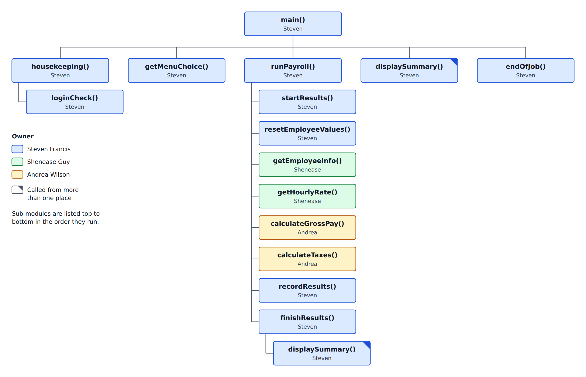

# Payroll Program — System Design

**Team:** Red Group 1 (team name to be chosen) · **Leader:** Steven Francis · **Draft 1**, Oct 3, 2026
**Tool:** pseudocode, in the textbook's style (*Programming Logic and Design*)

This page is the agreement that lets the three of us write our modules separately and have them fit together. If something here needs to change, tell Steven so the page and the main program get updated.

## 1. What the program does

1. The payroll clerk enters an access code (3 tries).
2. A menu appears: **1** Run payroll, **2** View summary, **3** Exit.
3. "Run payroll" repeats these steps for each of the 10 employees:
   1. Enter first name, last name, ID, dependents and hours, with security checks *(Shenease)*
   2. Look up the hourly rate using the employee ID *(Shenease)*
   3. Calculate gross pay, including overtime *(Andrea)*
   4. Calculate state tax, federal tax and net pay *(Andrea)*
   5. Save the employee's row to the spreadsheet and add it to the totals *(Steven)*
4. A summary shows how many employees were paid, flagged and skipped, plus the pay and tax totals.

## 2. Hierarchy chart



The same chart as text. Sub-modules are listed in the order they run:

```
main()                              Steven
├── housekeeping()                  Steven
│   └── loginCheck()                Steven
├── getMenuChoice()                 Steven
├── runPayroll()                    Steven
│   ├── startResults()              Steven
│   ├── resetEmployeeValues()       Steven
│   ├── getEmployeeInfo()           Shenease
│   ├── getHourlyRate()             Shenease
│   ├── calculateGrossPay()         Andrea
│   ├── calculateTaxes()            Andrea
│   ├── recordResults()             Steven
│   └── finishResults()             Steven
│       └── displaySummary()        Steven
├── displaySummary()                Steven
└── endOfJob()                      Steven
```

`displaySummary()` appears twice because it is one module called from two places.

## 3. Modules and owners

| # | Module | Sub-modules | What it does | Owner |
|---|---|---|---|---|
| — | System design | This page | Hierarchy chart, shared variable list, what each module must do | Steven |
| 0 | Main program | `main`, `housekeeping()`, `loginCheck()`, `getMenuChoice()`, `runPayroll()`, `resetEmployeeValues()`, `endOfJob()` | Access code, menu, the 10-employee loop, calling every other module in order | Steven |
| 1 | Employee information | `getEmployeeInfo()` | Entry of name, ID, dependents and hours, with security checks on each | Shenease |
| 2 | Rate lookup | `getHourlyRate()` | Finds the hourly rate using the employee ID as the primary key (becomes a database lookup in Module 8) | Shenease |
| 3 | Gross pay | `calculateGrossPay()` | Regular pay up to 40 hours, overtime at 1.5× over 40 | Andrea |
| 4 | Taxes and net pay | `calculateTaxes()` | State tax 5.6%, federal tax 7.9%, net pay | Andrea |
| 5 | Record results | `startResults()`, `recordResults()`, `finishResults()`, `displaySummary()` | Writes each row to the spreadsheet, keeps totals, shows the summary | Steven |
| — | Testing | Test log | Each module is tested by someone other than its author. Testing lead: to be decided | Everyone |

Owners can split their module into more sub-modules if that helps. Just keep the module names that main calls.

## 4. How the modules share data

All variables and constants are declared **once, in main**, the same way as the Module 2 exercises. Every module reads and changes those same variables. That means:

- Use the names in section 5 **exactly as spelled**.
- Do not declare these variables again inside your module.
- Need a new shared variable? Add it to section 5 and tell Steven, so it gets added to main's declarations.
- Variables used only inside your own module (for example a retry counter) can be declared in your module.

## 5. Shared variable list

### Constants

| Name | Type | Value | Meaning | Used by |
|---|---|---|---|---|
| `NUM_EMPLOYEES` | num | 10 | Employees in one payroll run | Steven |
| `MAX_ATTEMPTS` | num | 3 | Tries allowed for the access code (reusable for entry retries) | Steven, Shenease |
| `ACCESS_CODE` | string | "PAY2026" | Code the clerk must enter | Steven |
| `RUN_CHOICE`, `REPORT_CHOICE`, `EXIT_CHOICE` | string | "1", "2", "3" | The valid menu choices | Steven |
| `RESULTS_FILE` | string | "PayrollResults.csv" | The spreadsheet file | Steven |
| `REG_HOURS` | num | 40 | Hours paid at the regular rate | Andrea |
| `OT_RATE` | num | 1.5 | Overtime multiplier | Andrea |
| `STATE_TAX_RATE` | num | 0.056 | State tax, 5.6% | Andrea |
| `FED_TAX_RATE` | num | 0.079 | Federal tax, 7.9% | Andrea |
| `MAX_HOURS` | num | 60 | Hours above this are unusual and get flagged (proposed value) | Shenease |

### Variables set by Module 1 and Module 2 (Shenease)

| Name | Type | Meaning |
|---|---|---|
| `empFirstName` | string | Employee's first name |
| `empLastName` | string | Employee's last name |
| `empID` | string | Employee ID, the primary key for the rate lookup. A string so that leading zeros are kept |
| `numDependents` | num | Number of dependents (whole number) |
| `hoursWorked` | num | Hours worked this pay period |
| `hourlyRate` | num | Pay rate found by the lookup |
| `entryStatus` | string | "OK", "FLAGGED", "SKIPPED" or "ERROR" (see section 7) |

### Variables set by Module 3 and Module 4 (Andrea)

| Name | Type | Meaning |
|---|---|---|
| `regularPay` | num | Pay for hours up to 40 |
| `overtimePay` | num | Pay for hours over 40 |
| `grossPay` | num | `regularPay + overtimePay`. This is the **pre-tax amount** |
| `stateTax` | num | `grossPay × STATE_TAX_RATE` |
| `fedTax` | num | `grossPay × FED_TAX_RATE` |
| `netPay` | num | `grossPay − stateTax − fedTax`. This is the **post-tax amount** |

### Variables set by Module 0 and Module 5 (Steven)

| Name | Type | Meaning |
|---|---|---|
| `loggedIn` | string | "Y" once the access code is accepted |
| `codeEntered` | string | What the clerk typed for the access code |
| `attemptCount` | num | Access code tries used so far |
| `menuChoice` | string | The clerk's menu choice |
| `employeeCount` | num | Which employee is being processed, 1 to 10 |
| `payrollHasRun` | string | "Y" once a payroll run has finished |
| `payrollSheet` | OutputFile | The results spreadsheet |
| `processedCount`, `flaggedCount`, `skippedCount`, `errorCount` | num | Counts for the summary |
| `totalGrossPay`, `totalStateTax`, `totalFedTax`, `totalNetPay` | num | Running totals for the summary |

## 6. What each module must do

Before each employee, main clears every employee variable and sets `entryStatus = "OK"`.

### Module 1 — `getEmployeeInfo()` (Shenease)

- **Sets:** `empFirstName`, `empLastName`, `empID`, `numDependents`, `hoursWorked`
- **Security checks:** each value is checked when it is entered, and the clerk is asked again if it is wrong (blank name, ID in the wrong format, dependents not a whole number, hours not a number or negative).
- **Unusual hours:** if hours are above `MAX_HOURS`, ask the clerk to confirm. If confirmed, keep the hours and set `entryStatus = "FLAGGED"`.
- **Giving up:** if the entry still is not valid after the allowed tries, set `entryStatus = "SKIPPED"` and return.

### Module 2 — `getHourlyRate()` (Shenease)

- **Uses:** `empID`
- **Sets:** `hourlyRate`
- **Not found:** if the ID has no rate on file, output a message and set `entryStatus = "SKIPPED"`.
- Main only calls this module when the employee has not been skipped.

### Module 3 — `calculateGrossPay()` (Andrea)

- **Uses:** `hoursWorked`, `hourlyRate`, `REG_HOURS`, `OT_RATE`
- **Sets:** `regularPay`, `overtimePay`, `grossPay`
- Hours up to 40 are paid at the hourly rate. Hours over 40 are paid at 1.5 times the hourly rate.

### Module 4 — `calculateTaxes()` (Andrea)

- **Uses:** `grossPay`, `STATE_TAX_RATE`, `FED_TAX_RATE`
- **Sets:** `stateTax`, `fedTax`, `netPay`
- Both taxes are calculated on gross pay. Round each tax to the nearest cent.
- Main only calls Modules 3 and 4 when the employee has not been skipped.

### Module 5 — `recordResults()` (Steven)

- **Uses:** every employee variable above
- **Sets:** the counts and totals, and may change `entryStatus` to "ERROR"
- Writes one spreadsheet row per employee, whatever the status.

## 7. Status values

| `entryStatus` | Meaning | Set by | What happens |
|---|---|---|---|
| "OK" | Everything is normal | Main, before each employee | Paid and added to the totals |
| "FLAGGED" | Unusual but confirmed, such as hours above `MAX_HOURS` | Module 1 | Paid, added to the totals, and counted as flagged for review |
| "SKIPPED" | Entry could not be completed, or the ID was not found | Module 1 or 2 | Not calculated. Saved as a row with zeros. Not in the totals |
| "ERROR" | Calculated amounts do not make sense | Module 5 | Saved as a row for review. Not in the totals |

Spell these in capital letters exactly as shown.

## 8. Open questions

| Question | Who decides |
|---|---|
| Team name | Team, at the Oct 3 meeting |
| Testing lead | Team, at the Oct 3 meeting |
| Employee ID format (suggestion: 4 digits, such as 1001) | Shenease |
| Is 60 the right value for `MAX_HOURS`? Should zero hours also be flagged? | Shenease |
| Dependents are entered and saved, but none of the required calculations use them. Should they affect tax? | Ask the instructor |
